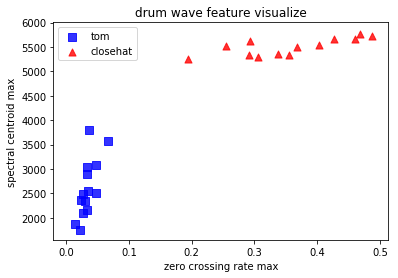

## Drum-Point-Analyze

这是一个利用已有的数据对计算机进行训练，然后再通过录音的方式获取样本，判定其鼓点是属于Tom还是closehat。

首先当然是要安装库，可以使用requirement.txt来安装，使用

```powershell
pip install -r requirement.txt
```

如果出现超时或者提示VC++未安装，可以使用库内的文件进行安装，使用

```powershell
pip install PyAudio-0.2.11-cp37-cp37m-win_amd64.whl
```

然后在文件中进行导入

```python
import pyaudio
import wave
import numpy as np
import time
from tkinter import TclError
import matplotlib.pyplot as plt
import librosa
from scipy.fftpack import fft
import pandas as pd
import os
import sys
import json
import math
from sklearn import neighbors
```

利用文件内已有的样本数据文件features_1.json来训练我们的计算机。先要读取数据

```python 
print(len(features))
for i in range(len(features)):
    if (classes[i] ==3 ):
        tom_zcrs_max.append(features[i][0])
        tom_cent_max.append(features[i][1])
    else: 
        closehat_zcrs_max.append(features[i][0])
        closehat_cent_max.append(features[i][1])
print(tom_zcrs_max)
print(tom_cent_max)
print(closehat_zcrs_max)
print(closehat_cent_max)
```

这样就可以把数据存进tom_zcrs_max、tom_cent_max、closehat_zcrs_max、closehat_cent_max中，其中，zcrs是过零率，cent是频谱质心。利用这两个数据，我们能够将tom和closehat两种音色分开，其散点图如下：



可以看到两种音色都分布在了一块，这样使用KNN算法就能够很快地辨别它是属于什么。

对KNN进行训练

```python
knn = None
knn = neighbors.KNeighborsClassifier() 
# 训练knn分类器
knn.fit(features, classes)
predicted = None
predicted=knn.predict(features)
accuracy = np.mean(predicted==classes)
print(accuracy)
```

这里因为是使用样本训练，使用样本预测，所以accuracy应该是等于1的

然后我们就要利用麦克风采集样本，利用一个死循环：

```python
while True:

    # 由于每次从流中获取数据是以缓冲区为单位，RECORD_SECONDS时间内会获取不止一个chunk大小的样本
    # 将每次从缓冲区取出的数据放入frames数组中，随后将它们拼接起来
    frames = []
    for i in range(0, int(RATE / CHUNK * RECORD_SECONDS)):
        data = stream.read(CHUNK, exception_on_overflow = False)
        data_np =  np.frombuffer(data, dtype=np.int16)
        frames.append(data_np)

    audio_data = np.hstack(frames)
```

读取到样本我们就可以开始画图，可以不断重复这个过程绘画出不断变化的图

```python
    # 将样本归一化到[0, 1]范围内
    audio_data_norm = audio_data / float(np.amax(np.abs(audio_data)))
    
    
    
    # 画图
    line.set_ydata(audio_data)
    
    audio_data = audio_data.astype(np.float32)
    # audio_data包含了在设定的时间范围内获取的音频样本
    # 需要对该样本使用librosa库进行特征提取
    # 你需要正确生成这个对象：
    # zcrs：使用librosa库从audio_data获取的过零率数据
    # cent：使用librosa库从audio_data获取的频谱质心数据
    zcrs = []
    cent = []
    cent=librosa.feature.spectral_centroid(y=audio_data,sr=44100)
 zcrs=librosa.feature.zero_crossing_rate(audio_data,frame_length=CHUNK)   
    
    # 输出结果到下方标准输出
    clear_output()
    
    display(audio_data_norm.shape)
    
    display("zcrs: " + str(zcrs))
    display("cent: " + str(cent))
    
    zcrs_max = np.max(zcrs[0]) # 过零率的最大值
    cent_max = np.max(cent[0]) # 频率质心的最大值
    display("zcrs_max: " + str(zcrs_max))
    display("cent_max: " + str(cent_max))
    
    # 使用knn分类器对上述样本的两个特征进行分类
    # 你需要正确生成这个对象：
    # predicted：使用knn分类器返回预测标签
    predicted = [None]
    # =========你的代码=========
    predicted = knn.predict([[zcrs_max, cent_max]])
    display("predict:"+ class_names_1[predicted[0]])
    
     #  更新图表
    try:
        fig.canvas.draw()
        fig.canvas.flush_events()
    
    # 关闭图表，中断循环
    except TclError:
        display('stream stopped')
        break
```

